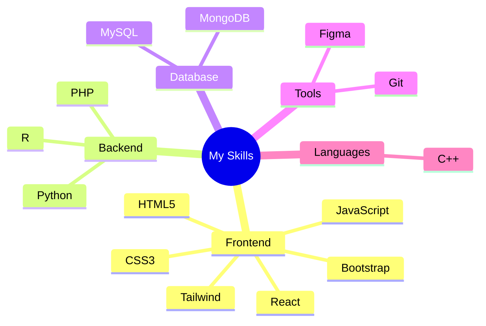

  

<h1 align="center">
  
</h1>

<h3 align="center">
   Developer | KJ Somaiya College of Engineering 
</h3>

  

## 🚀 Quick Facts

- 🔭 I'm currently working on **Awesome Projects**
- 🌱 Learning **New Technologies**
- 💬 Ask me about **Web Development**
- ⚡ Fun fact: **I code better with coffee ☕**

## 💻 Tech Stack

### 🎨 Frontend Development

### ⚙️ Backend & Languages

### 🗄️ Databases & Tools

## 📊 GitHub Stats

  
  

  

## 🌐 Let's Connect

  
  
  
  

  

---

  

